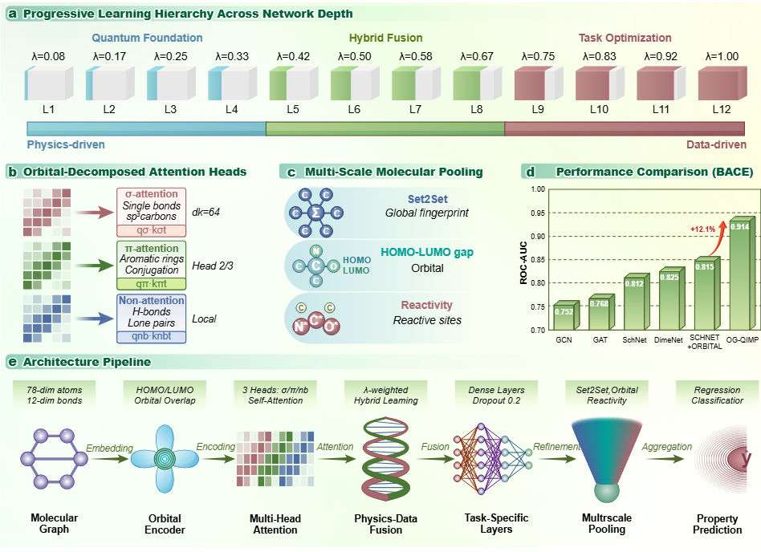

# From Physics Constraints to Adaptive Discovery: OG-QIMP Enables Quantum-Informed Molecular Property Prediction

## Abstract
Scientific machine learning demands models that understand physical laws rather than memorize correlations. Current graph neural networks treat molecular interactions statistically, limiting their ability to generalize across chemical space. We present OG-QIMP (Orbital-Guided Quantum-Informed Molecular Learning), a framework that reconciles quantum mechanics with deep learning through a progressive physics-to-data paradigm. Early layers follow orbital theory via σ/π/non-bonding attention guided by quantum overlap integrals, while deeper layers adaptively refine representations through data-driven transformations. This design yields interpretable, transferable molecular representations aligned with chemical bonding theory. Theoretically, we prove that the linear progressive weighting minimizes a composite physics–data loss, ensuring optimal balance between consistency and adaptability. OG-QIMP achieves state-of-the-art performance on seven molecular benchmarks and retains 81.8% accuracy under severe distribution shift, over 35% higher than conventional GNNs, demonstrating robust generalization. By dynamically integrating physics and data, OG-QIMP establishes a new principle for adaptive physics-informed learning, advancing the frontier of interpretable and robust scientific AI.

## Key Innovations and Model Structure


## Usage
### Requirements
The following versions of frameworks and libraries were used in this project:

- **PyTorch**: 2.0.0+cu117  
- **CUDA**: 11.7  
- **DGL**: 1.1.3+cu117

### Run
```python main.py```
